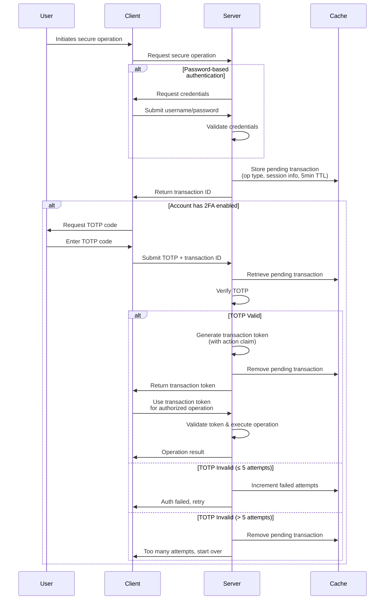

# Auth

## Context

Our application requires secure authentication and authorization mechanisms that protect sensitive operations while maintaining a good user experience.

## Decision

We will implement a comprehensive authentication and authorization system with the following components:

1. **Basic Authentication**: Username/password authentication as the first authentication factor
2. **Two-Factor Authentication (2FA)**: Optional TOTP-based 2FA for additional account security
3. **Transaction Token System**: Short-lived, single-use tokens to bind TOTP verification to secure operations
4. **Step-up Authentication**: Additional verification for sensitive operations
5. **Password Reset Mechanism**: Secure, one-time-use tokens for password resets

### Implementation Details

#### TOTP Authentication

- Time-based One-Time Password (TOTP) will be used for:
  - Email verification during sign-up
  - Email change verification
  - Two-factor authentication during login
  - Step-up authentication for sensitive operations

#### Transaction Token System

- When initiating a secure operation that requires additional verification:
  1. A pending transaction record is created and stored in a short-lived (5 minutes) server cache
  2. The record contains metadata including:
     - The intended operation type
     - Session information
     - User context
  3. A unique transaction ID is returned to the client
  4. The client must submit this transaction ID with a valid TOTP to complete the operation
  5. Upon successful verification, a short-lived (5 minutes), one-time-use "transaction token" is issued
  6. The transaction token contains an `action` claim specifying the authorized operation
  7. The pending transaction is removed from cache to prevent replay attacks

#### Security Measures

- Failed TOTP verification attempts against a pending transaction are limited to 5 attempts
- After 5 failed attempts, the pending transaction is purged to prevent brute force attacks
- One-time-use tokens are enforced using a JTI (JWT ID) blocklist
- All sensitive tokens have a maximum lifetime of 5 minutes
- Password reset tokens are only exposed via URLs in related emails
- Step-up authentication is required for sensitive operations (e.g., email change, security settings)

## Authentication Flow Diagram

